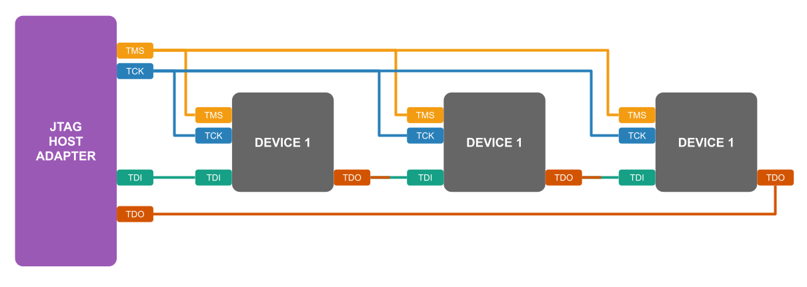

# Comment faire du boundary-scan avec le CJMCU-232H ?

## JTAG Pinout & Connexions

| CJMCU     | FT232H        | Function  |
|-----------|---------------|-----------|
| D0        | (13) ADBUSS0  | TCK/SK    |
| D1        | (14) ADBUSS1  | TDI/DI    |
| D2        | (15) ADBUSS2  | TDO/DO    |
| D3        | (16) ADBUSS3  | TMS/CS    |

Schemas de la carte ADAFRUIT_FT232H (similaire à la carte CJMCU)

