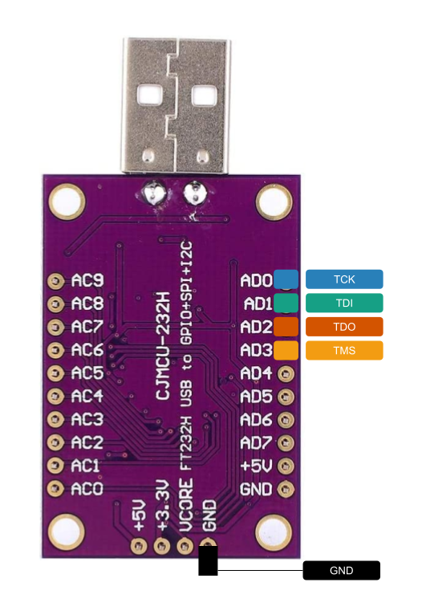

# Comment faire du boundary-scan avec le CJMCU-232H

Example to show how to use CJMCU-232H chip to perform boundary scan with Panduza.

## FT232H Pins used in an MPSSE

- 13 : TCK/SK
- 14 : TDI/DI
- 15 : TDO/DO
- 16 : TMS/CS

## On the Adafruit FT232H Breakout / CJMCU (clone)

| Breakout  | FT232H        | Function  |
|-----------|---------------|-----------|
| D0        | (13) ADBUSS0  | TCK/SK    |
| D1        | (14) ADBUSS1  | TDI/DI    |
| D2        | (15) ADBUSS2  | TDO/DO    |
| D3        | (16) ADBUSS3  | TMS/CS    |

