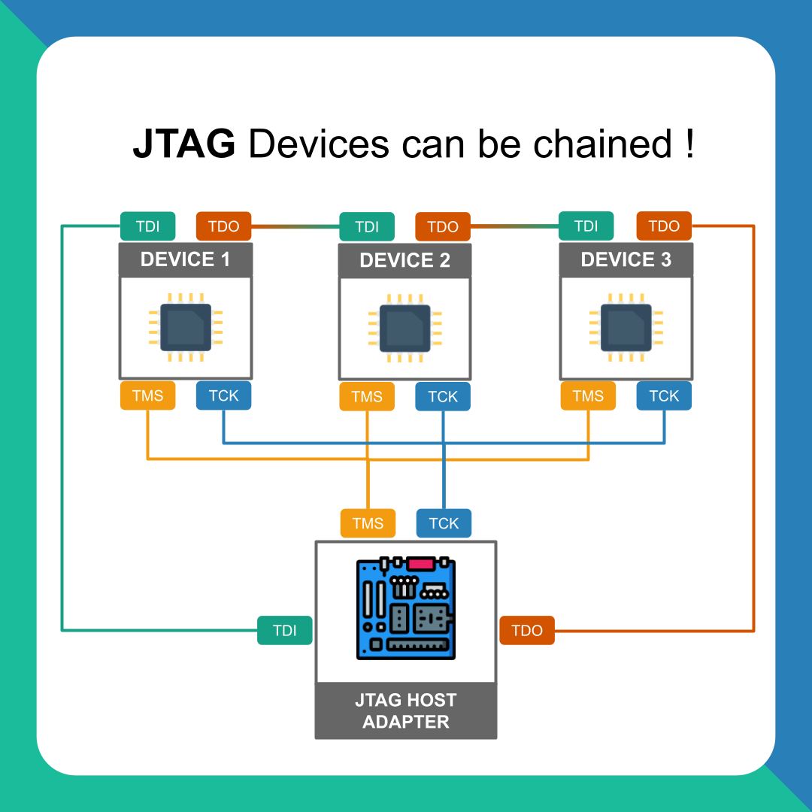
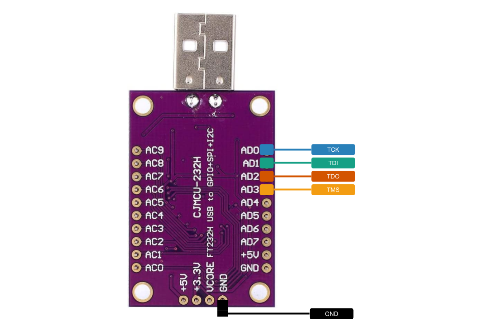
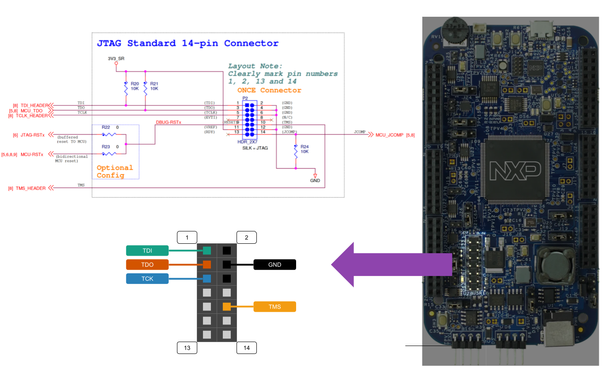

# Comment faire du boundary-scan avec le CJMCU-232H ?

## JTAG Connexions

Pour connecter un composant à l'adaptateur USB connectez les éléments comme sur le schéma suivant

Plus d'info sur le JTAG ici :

- https://www.instagram.com/p/CiiGDTJNnXf/?utm_source=ig_web_copy_link

## CJMCU JTAG Pinout

| CJMCU     | FT232H        | Function  |
|-----------|---------------|-----------|
| D0        | (13) ADBUSS0  | TCK/SK    |
| D1        | (14) ADBUSS1  | TDI/DI    |
| D2        | (15) ADBUSS2  | TDO/DO    |
| D3        | (16) ADBUSS3  | TMS/CS    |

Schemas de la carte ADAFRUIT_FT232H (similaire à la carte CJMCU)

## DEVKIT-MPC5744P JTAG Pinout

## DEVKIT-MPC5744P Led Pinout

Une seule LED RGB sur la carte, elle est *active LOW*.

| Led       | MPC5744P Pin  |
|-----------|---------------|
| RED       | C_11          |
| GREEN     | C_12          |
| BLUE      | C_13          |

